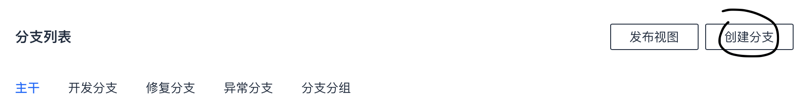

# Coding-DevOps开发平台体验报告

本文表述pinhenzhang作为新员工，对`coding.oa.com`的体验心得。

## DevOps工具链

DevOps工具链将需求、研发、测试、部署、上线和监控合并到一个平台实现，无需用户在多个工具间跳转。我印象中从2016年开始，Gitlab就逐步开发DevOps能力，还标榜自己是第一个实现DevOps全流程解决方案的平台。Github在被微软收购后，也逐步开放了DevOps能力。

coding里面也基本上包含了DevOps工具链的功能特性，如下：

- 需求分析和任务分派： `项目协同`
- 研发类：
	- `分支管理`
	- `流程单` -- 这个有点复杂，还在搞懂怎么用
	- `代码分析`
- 测试：`自动化测试`
- 部署：
	- `持续集成`
	- `制品库`
	- `持续部署`
- 上线：`持续运营`
- 监控：暂时没找到

## 一个研发工作人员的日常

### 新建分支开发代码

`coding`提供一个非常好的特性，就是分支管理。这个特性利用了Git超强的分支管理功能，不管是用[[Github Flow]]或者[[Git Flow]]，都能规范代码库的开发流程。

由于新建开发分支是一个很常见的动作，如果在创建分支的按钮上，能几个快捷下拉按钮，能一键式创建对象分支就更好了。比如`创建开发分支`，一键式就能创建`dev_20210112_pinhenzhang`这样的分支，这样能简化用户使用。

### 开发

研发人员新建分支后，开始编写代码，并进行测试和代码检视。不过我发现MergeRequest还需要跳到工蜂上才能进行，这部分是否考虑在coding上也包含进来，这样开发人员可以不用在2个平台间跳转。

### 测试

研发人员push代码合并后，需要将代码发布到测试环境进行验证。这就到了DevOps平台最重要的部分——流水线。流水线是DevOps平台的核心，是将DevOps各个流程串接到一起的最重要部分。**不夸张的说，流水线做的好不好，基本上决定了DevOps系统是否好用**。

流水线负责将构建、静态检查、测试、部署等流程串起来，因此流水线界面要跟多个系统交互，比较复杂。

`coding`的流水线界面可定制度高，非常灵活，但是对新手入门掌握不太友好。我进去后面对流水线的编辑界面，初次有点不知所措的感觉。应该是考虑到了这个问题，`coding`中引入了流水线模板的概念。但是有个问题是流水线模板没有预设的，第一次还是需要自己创建。

所以我建议根据常见开发项目，预置一些非常常见的模板。比如有一个`Java构建发布(gradle)`的模板就包含：

1. 使用gradle构建java项目，同时包含并行运行的静态检查（checkstyle/pmd/findbugs/开源漏洞扫描）
2. 测试环境的部署
3. 人工确认
4. 类生产环境部署
5. 人工确认
6. 生产环境部署

即使整个流水线后面跑不起来，但是用户看到某个有问题的步骤，就可以直接修改，总比不知道做啥好。

#### 发布区流水线

一般的场景下，都是用特定分支来发布流水线。但是在很多时候，我们可能需要多个分支一起发布，典型场景如下：

项目有好几个特性分支`featureA`/`featureB`/`featureC`已经开发完成，部分已经测试通过。我们想把所有特性分支都发布到测试环境上验证，但是发布生产环境的时候只发布`featureB`，`featureB`发布后再将其回合到`master`主干。

希望`coding`也能支持这种发布区流水线概念：
1. 只有进入发布区的分支才能在流水线上执行
2. 进入发布区的多个分支执行时，会产生多分支合并的一个临时的集成分支，最终在这个集成分支上执行
3. 如果多个分支合并失败，那么流水线直接失败
4. 部署生产环境/类生产环境验证无问题后，自动将发布区分支回合主干

**发布区流水线特别适合有多个特性同时在开发的仓库，测试时一起测试，发布时仅选择特定分支发布**。

### 度量和静态检查

代码分析提供了对代码的常见度量和静态检查功能。我建议在流水线配置的时候，能够支持对本次代码变动文件提供精确检查功能。

比如Java项目本次变动文件如下：

- `src/main/java/com/tencent/coding-oa/test/aaa.java`
- `src/main/java/com/tencent/coding-oa/test/bbb.java`
- `src/main/java/com/tencent/coding-oa/test/ccc.java`

在稍微大一点的项目中，研发人员很多，那我作为研发人员，肯定希望检查工具能精确地检查我这次变动过的三个文件，而不是将整个项目的检查结果呈现给我。当前的增量分析方案是上次成功分析版本和最新版本的差异代码，感觉还是跟本次MR的精确变动可能不一致。

### 制品库

主要用于存储构建产物，比如Docker镜像，python库，java库等。底层基础设施之一，稳定性和效率上是最重要的，开发人员每天都需要根其打交道。

`coding`内置制品库非常方便，不用再自己劳神费力地搭建私有仓库，点一个大大的赞！

### 上线

当前`coding`通过变更单来对生产环境的改动进行管控，不过看了一下好多输入栏是针对腾讯云现网的，对于内部oa服务可能会不涉及？是否可以考虑针对内部oa服务的输入简化下？